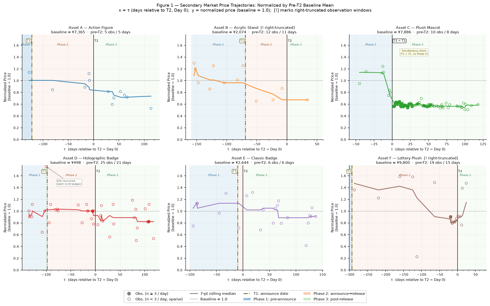
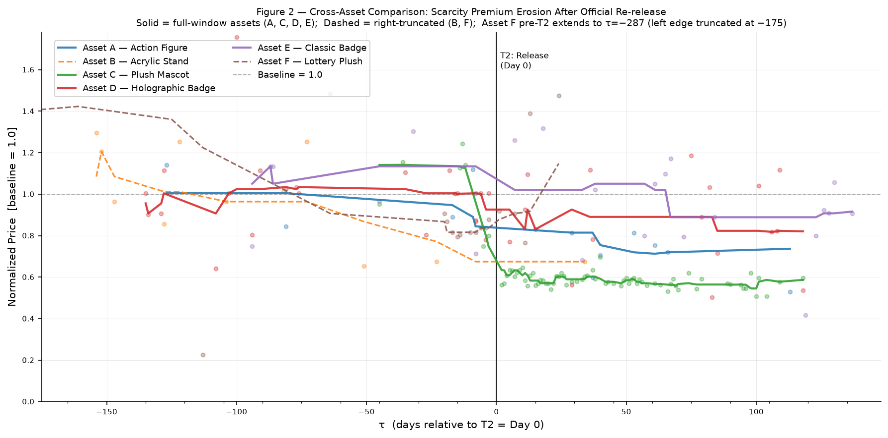
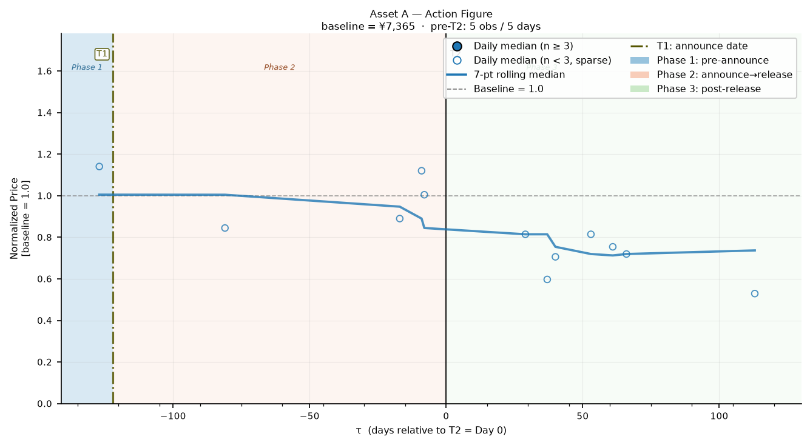
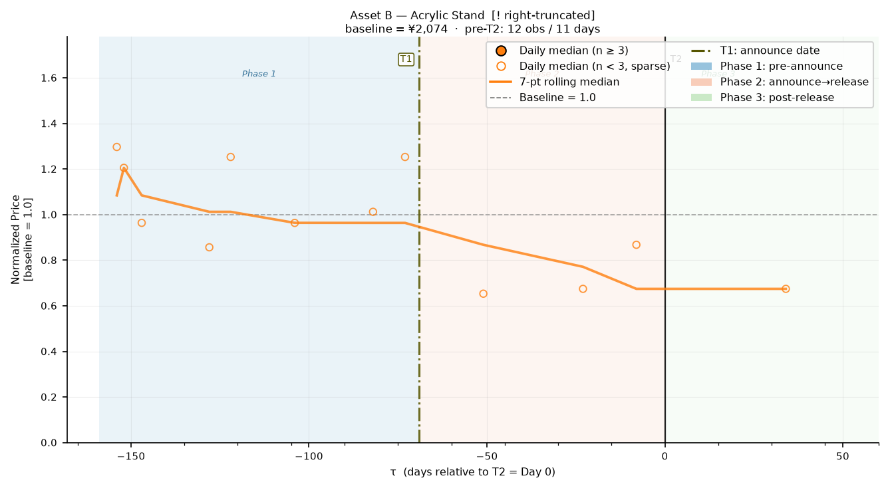
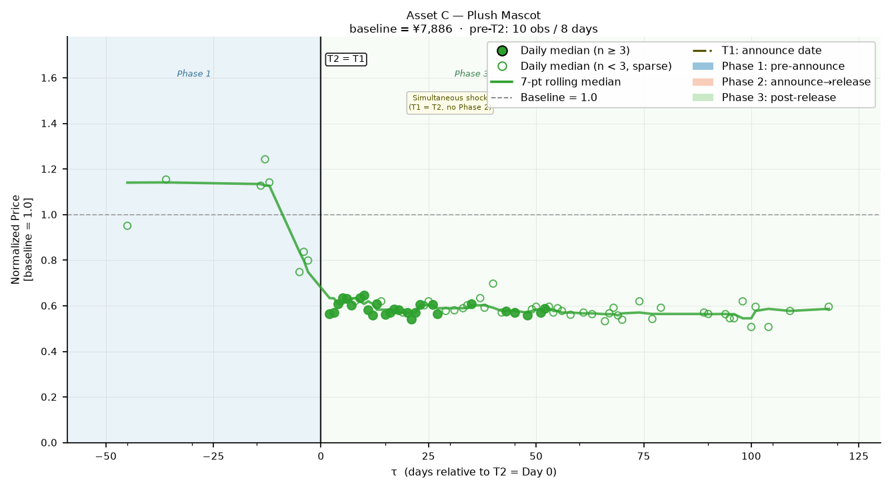
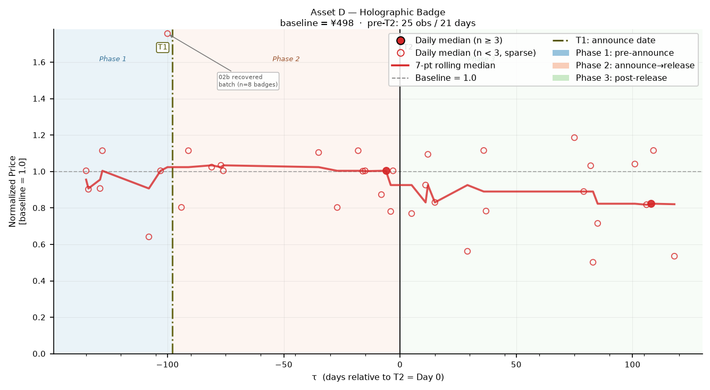
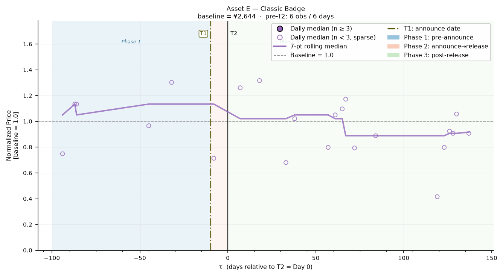
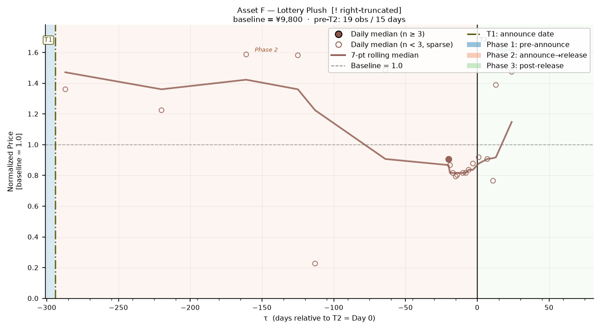

# Exogenous Supply Shocks and Scarcity-Premium Erosion in Closed C2C Secondary Markets: Evidence from Japanese IP-Based Alternative Assets

**Working Paper — Draft for Internal Review**
*Data collection cutoff: July 31, 2026*

---

## Abstract

This paper investigates the price dynamics of limited-edition, IP-based physical collectibles traded on closed consumer-to-consumer (C2C) secondary markets following an exogenous supply shock — namely, an official manufacturer-sanctioned re-release of a previously scarce asset. Using an event study methodology anchored on two distinct event dates — the public announcement date (T1) and the physical availability date (T2) — we construct a relative timeline (T2 = Day 0) and examine transaction price trajectories across an event window extending up to 90 days prior to T1 through 120 days following T2, for a portfolio of six heterogeneous, illiquid Japanese IP-based alternative assets. Our identification relies on the timing of official re-releases, which is set by manufacturers' production and marketing schedules rather than by short-run movements in secondary-market prices; the decision to re-release a given item may itself reflect accumulated demand, and the current design does not include an untreated comparison group (Section 5.4). We further introduce a novel multimodal LLM-assisted data validation pipeline — employing a two-pass vision-language model architecture — to address the endemic problem of bundle-sale noise in C2C listing environments, a methodological contribution with broader applicability to scraped marketplace data. Across the six-asset portfolio, we find consistent evidence of scarcity-premium erosion following T2: five of six assets exhibit below-baseline normalised prices in Phase 3 (post-availability), with average erosion ranging from 5.7% to 41.6%. The most statistically robust case (Asset C, Plush Mascot, simultaneous announcement and availability, 207 Phase 3 transactions) documents a persistent 42% erosion that is already in place at the first post-release transactions, with prices beginning to slide a few days before the official date, consistent with an information leak. Cross-asset variation is partly explained by differential announcement lead times, consistent with an anticipation effect whereby advance disclosure enables gradual pre-release price adjustment.

**Keywords:** alternative assets, scarcity premium, secondary markets, event study, platform economics, exogenous supply shock, C2C marketplaces, illiquid collectibles, IP-based assets

---

## 1. Introduction

The emergence of C2C digital marketplaces — platforms such as Mercari, eBay, and their regional analogues — has institutionalised secondary trading in a class of assets that conventional finance largely overlooks: limited-edition, brand-licensed physical collectibles. These objects, produced under intellectual property (IP) licensing agreements and manufactured in deliberately constrained quantities, exhibit many of the structural characteristics associated with alternative assets in traditional portfolio theory: low correlation with public equities, inelastic short-run supply, and price formation driven predominantly by perceived scarcity rather than intrinsic utilitarian value.

A central mechanism sustaining elevated secondary-market valuations for such assets is the **scarcity premium** — the price wedge between the asset's original retail price and its prevailing C2C transaction price, attributable to supply-side closure enforced by manufacturers and licensed distributors. So long as the manufacturer refrains from restocking or re-releasing a discontinued SKU, the secondary market functions as a closed system in which price discovery is governed exclusively by the interaction of residual supply (held by existing owners willing to sell) and secondary demand (collectors seeking acquisition outside the primary channel).

This equilibrium, however, is vulnerable to a specific class of disruption: the **official re-release event**, in which the original IP rights holder or its manufacturing partner announces and executes a new production run of the previously scarce asset. Such an event constitutes a plausibly **exogenous supply shock** with respect to its timing — it originates outside the secondary market, is determined by strategic considerations at the manufacturer level (e.g., demand from a new licensing window, anniversary campaign, or cross-regional distribution strategy), and injects a credible expectation of expanded supply into a market that had been pricing the asset as permanently scarce. The decision to re-release a particular item is unlikely to be random: manufacturers plausibly favour items with visible secondary-market demand. The design therefore identifies the price response around a sharply dated supply event, not the effect of a randomly assigned re-release.

The informational and price dynamics surrounding such events remain empirically underexplored. While the broader event study literature in finance has documented the speed and completeness of price adjustment to public disclosures in equity markets, analogous investigations in illiquid, non-fungible physical asset markets are scarce. The structural differences are non-trivial: C2C collectible markets feature thin trading, heterogeneous listing quality, asynchronous price discovery, and endemic data quality problems — including the widespread practice of bundling multiple units into a single listing, which systematically distorts observed per-unit prices.

This paper addresses these gaps with three principal contributions:

1. **Empirical evidence on scarcity-premium erosion.** We provide systematic, transaction-level evidence on the magnitude and temporal trajectory of price decline following official re-release announcements and physical availability events across a diversified portfolio of Japanese IP-based alternative assets.

2. **A dual-anchor event study design.** By distinguishing between the announcement date (T1) and the physical availability date (T2), we decompose the shock's total price impact into an *anticipation effect* (the pre-T2 price revision attributable to the credible announcement at T1) and a *realisation effect* (the further adjustment upon confirmed availability). This design enables a cleaner attribution of price dynamics that single-anchor studies cannot achieve.

3. **A multimodal LLM validation pipeline for C2C data cleaning.** We introduce a systematic method for detecting and correcting bundle-sale listings using a vision-language model (VLM), substantially improving the signal quality of scraped C2C transaction data — a methodological advance with broad applicability beyond the present study.

The remainder of the paper is organised as follows. Section 2 situates our inquiry within the relevant theoretical literatures on scarcity rents, information disclosure, and platform market dynamics. Section 3 describes the data construction process, the event study design, and our cleaning methodology. Section 4 presents the empirical findings. Section 5 concludes.

---

## 2. Theoretical Framework

### 2.1 Scarcity Rents and Artificial Supply Constraints

Standard resource economics holds that scarcity rents arise whenever binding supply constraints prevent markets from clearing at marginal cost; this framework extends naturally to manufactured goods where scarcity is *strategically* rather than naturally imposed. Manufacturers of luxury goods and limited-edition collectibles routinely exploit artificially constrained supply to sustain price premiums, signal exclusivity, and manage brand equity. This strategy generates a durable secondary-market premium: since primary-channel access is restricted, collectors who missed the initial release window must pay a mark-up to acquire the asset through C2C channels.

In the context of Japanese IP-based alternative assets — a category encompassing licensed character merchandise produced under franchise agreements with anime, manga, and gaming rights holders — this dynamic is particularly pronounced. Production runs are often announced as strictly limited, with no explicit commitment to future restocking. The resulting secondary-market premiums can sustain significant price levels for extended periods, constituting a form of scarcity rent accruing to early acquirers who retain holding positions.

### 2.2 Exogenous Supply Shocks and Information Disclosure

Standard event study methodology posits that in informationally efficient markets, asset prices adjust rapidly and without bias to the arrival of new public information. A manufacturer's re-release announcement constitutes precisely such an information event: it reveals that the supply constraint — previously assumed permanent — is, in fact, temporary and reversible. Under the efficient markets hypothesis, secondary-market prices should adjust immediately at T1 to reflect the updated expectation of future supply.

However, several frictions specific to C2C collectible markets may cause adjustment to be slower, incomplete, or non-monotonic:

- **Illiquidity and thin trading:** Low transaction frequency impedes rapid price discovery, as sellers may not update asking prices continuously.
- **Belief heterogeneity:** Agents may disagree about the credibility of a re-release announcement, the likely volume of new supply, or the timing of physical availability, resulting in gradual rather than instantaneous price convergence.
- **Anchoring and loss aversion:** Sellers who acquired assets at elevated secondary-market prices may be reluctant to mark down holdings to reflect new supply expectations, consistent with anchoring and loss-aversion effects well-documented in illiquid asset markets.
- **Delivery uncertainty:** Between T1 and T2, uncertainty about whether the re-release will actually ship on schedule may suppress the full price adjustment until physical availability is confirmed.

These frictions motivate our dual-anchor design: by examining price dynamics both at T1 and T2, we can empirically characterise the *speed* and *completeness* of adjustment — questions that bear directly on the degree of informational efficiency in this asset class.

### 2.3 Platform Economics and C2C Market Structure

According to two-sided platform economics theory, C2C marketplaces such as Mercari function as intermediaries mediating transactions between atomistic buyers and sellers. In contrast to dealer markets or auction houses, C2C platforms exert minimal direct influence over price formation: listing prices are set unilaterally by sellers, and transaction prices emerge from bilateral negotiation or direct purchase at listed prices. This structure implies that price dynamics reflect the *aggregate* of individual seller beliefs and strategies, rather than a centralised market-making process.

The closed nature of such platforms — in the sense that supply of the underlying asset is not endogenously responsive to secondary-market price signals — creates conditions for sustained scarcity premiums. A re-release event breaks this closure by re-coupling the secondary market to the primary supply chain, fundamentally altering the market's informational environment and supply expectations.

---

## 3. Data & Methodology

### 3.1 Data Sources and Asset Portfolio Construction

Transaction-level price data were sourced from aucfan.com, a third-party price history aggregation service that tracks completed transactions across major Japanese C2C marketplaces, including Mercari Japan. The service provides access to historical listing-level records — including transaction price, transaction date, listing title, thumbnail image URL, and item page URL — which were exported as timestamped CSV files and stored per asset in a hierarchical directory structure (`data_raw/{asset_id}/`). The data coverage reflects aucfan's full transaction history for each queried search term, subject to the platform's retention window; the data collection process for this study was concluded on **July 31, 2026**, which constitutes the right-censoring boundary for all post-T2 observation windows.

To maximise the generalisability of our findings across asset types — and to guard against conclusions that are idiosyncratic to a single product category — we constructed a **highly diversified asset portfolio** comprising six distinct categories of illiquid physical assets:

| Asset ID | Asset Type | T1 (Announcement) | T2 (Availability) | T1→T2 Lead | Phase 3 Obs. Window |
|---|---|---|---|---|---|
| Asset A | Action Figure | 2025-08-26 | 2025-12-26 | 122 days | +120d (complete) |
| Asset B | Acrylic Stand | 2026-04-03 | 2026-06-11 | 69 days | +50d * (right-censored) |
| Asset C | Plush Mascot | 2025-12-19 | 2025-12-19 | 0 days (T1 = T2) | +120d (complete) |
| Asset D | Holographic Badge | 2025-10-16 | 2026-01-22 | 98 days | +120d (complete) |
| Asset E | Classic Badge | 2026-03-02 | 2026-03-12 | 10 days | +141d (complete) |
| Asset F | Lottery Plush | 2025-07-31 | 2026-05-21 | 294 days | +71d † (right-censored) |

*\* Subject to right-censoring at the data collection cutoff (July 31, 2026); see Section 3.5.*
*† Subject to right-censoring at the data collection cutoff; see Section 3.5.*

The six asset categories span a meaningful range of product formats, price tiers, and collector-market dynamics, from highly engineered posable figures (Asset A) to accessory-grade holographic badges (Asset D) and chance-based lottery plush toys (Asset F). This cross-category diversity strengthens the external validity of any price-dynamic patterns identified.

In accordance with data privacy norms and to maintain analytical focus on structural market phenomena rather than IP-specific narratives, all assets are referred to exclusively by anonymised identifiers (Asset A through Asset F) throughout this paper. The underlying Japanese IP names are retained only in internal data files and are not disclosed in published outputs (**asset anonymization protocol**).

### 3.2 Dual-Anchor Event Study Design

We adopt a **dual-anchor event study** framework, identifying two event dates for each asset:

- **T1 (Announcement Date):** The date on which the manufacturer or official distributor publicly disclosed the re-release, typically via official social media channels or licensed retailer announcements. T1 marks the onset of *informational exposure* to the supply shock.
- **T2 (Physical Availability Date):** The date on which re-released units became physically accessible to consumers through primary retail channels (in-store availability or fulfilment of pre-orders). T2 marks the onset of *material supply expansion*.

All price observations are expressed on a **relative time axis** $\tau = \text{calendar date} - T2$, with T2 defined as Day 0. This alignment removes calendar-date heterogeneity across assets and enables superimposable cross-asset comparison of price trajectories. Under this parameterisation, T1 corresponds to a negative relative day $\tau_{T1} = T1 - T2 \leq 0$ for all assets except Asset C (see Section 3.5.1).

The **primary event window** spans from 90 days prior to T1 through the asset-specific post-availability cutoff (up to +120 days after T2): $`\tau \in [\tau_{T1} - 90,\ \tau_{\max}]`$, where $`\tau_{T1} = T1 - T2`$ (a negative integer for all assets except Asset C) and $`\tau_{\max}`$ is the asset-specific post-availability cutoff (`max_post_day` in the code), which reflects each asset's data availability (see Table above). The 90-day pre-T1 window is defined as Phase 1 (pre-announcement baseline); the T1-to-T2 interval constitutes Phase 2 (anticipation period); and $\tau \geq 0$ defines Phase 3 (post-availability). All pre-T2 observations ($\tau < 0$, combining Phase 1 and Phase 2 where applicable) serve as the baseline estimation pool; full details of the baseline construction are provided in Section 3.6.

### 3.3 Data Cleaning and Outlier Treatment

The raw transaction dataset comprised **954 observations** across the six assets following global deduplication. Data cleaning proceeded through two sequential stages.

**Stage 1 — LLM purity classification** (described in detail in Section 3.4) was applied uniformly to all transactions. Listings classified as impure — bundles combining the target SKU with unrelated items, or items that did not match the reference product's SKU identity — were excluded from the analytical sample. Listings containing several units of the target SKU alone were retained, and their prices were divided by the unit count (Section 3.4). A keyword-based title pre-filter was applied prior to any API call; the filter flags listings containing explicit bundle indicators such as 詰め合わせ (assorted lot), 福袋 (lucky bag), and アソート (assortment). In the final production run, zero rows were hard-filtered at this stage because none of the scraped titles contained these terms; all bundle detection was therefore performed by the visual classifier. Of the 954 raw transactions, **478 (50.1%)** were classified as impure and removed, yielding 476 LLM-pure rows. The elevated impure rate is expected: action-figure lots and plush-toy bundles are routinely bundled with other IP merchandise on Mercari, and the classifier is designed to be conservative (favouring exclusion over inclusion) to preserve price series integrity.

**Stage 2 — IQR-based outlier treatment** was applied selectively by event phase. For the post-release period ($\tau \geq 0$, Phase 3), a per-asset Tukey fence (1.5 × IQR) was applied to remove residual anomalous transactions — principally multi-item lots that evaded visual classification and isolated data-entry errors. For the pre-announcement baseline period ($\tau < 0$, Phases 1 and 2), this filter was intentionally omitted: pre-event scarcity premiums are structurally higher than post-release prices, and applying a pooled-phase fence would artificially compress the very baseline against which supply shock effects are measured. A total of 48 observations (10.1% of LLM-pure rows) were removed by this IQR filter. A supplementary recovery pass subsequently re-examined the 58 high-price pre-T2 candidate rows that had been excluded by the initial broader IQR sweep from the preceding cleaning step, applying the LLM classifier without any IQR constraint; 11 transactions were reinstated as genuine single-unit pre-event listings.

In total, **439 transactions** were retained in the final clean dataset across the six assets.

### 3.4 Multimodal LLM Validation Pipeline

A pervasive and systematically underaddressed problem in C2C marketplace data is the **bundle-sale listing**: a single listing that packages multiple units of the target asset — or combines the target asset with unrelated items — at a single aggregate price. If ingested without correction, bundle listings introduce downward-biased per-unit price observations that contaminate the estimated price trajectory, particularly in the post-shock period when sellers frequently liquidate accumulated inventory in bulk. Text-only heuristics are insufficient for reliable identification, since listing titles routinely omit quantity information or use ambiguous phrasing; reliable disambiguation requires visual inspection of the product photograph.

We address this through a dedicated **multimodal LLM validation pipeline** with the following design components.

#### 3.4.1 Image Resolution Upgrade

Early-stage data collection retrieved the default CDN thumbnail associated with each listing (approximately 240 px compressed). For the production pipeline, we resolved all thumbnails to original full-resolution product photographs (1080 × 1080 px) via a deterministic URL transformation applied to Mercari's content delivery network. Full-resolution images provide materially greater discriminative information for both SKU identity assessment and quantity counting — particularly for small-format items such as pin badges, where multi-unit arrangements would be imperceptible in thumbnails.

#### 3.4.2 Text Context Anchor System

Each API call incorporates three structured text fields extracted from asset configuration and listing data:

- **Reference product name** (`jp_name`): the official Japanese product name of the target SKU, used to anchor the model's identity judgement to the specific character, franchise, and series.
- **Reference product type** (`product_type`): the product category (e.g., *ぬいぐるみ・マスコット* for plush mascots, *缶バッジ* for pin badges), providing a categorical anchor that helps discriminate between visually similar items of different product types sold under the same IP.
- **Listing title** (`title`): the seller's own title text, which may contain supplementary condition descriptors, character names, or lot-size signals not discernible from the photograph.

In cases of conflict between textual and visual signals — for instance, listing titles with inflated keyword lists (*keyword stuffing*) that enumerate multiple product types — the pipeline specifies that visual evidence takes precedence as the higher-fidelity channel. This prevents false-impure classifications driven by title-level noise.

#### 3.4.3 Model Selection

The VLM used in production is **GPT-4o-mini**, accessed via the OpenAI API at temperature = 0 to ensure deterministic output across identical inputs. An earlier iteration employed a lighter model (GPT-4.1-nano); the upgrade to GPT-4o-mini was motivated by substantially improved SKU discrimination for cases involving visually similar items within the same franchise — for example, different character variants within a badge series that differ in colourway and facial design but share the same format and packaging.

#### 3.4.4 Two-Pass Architecture

The most significant architectural innovation in the pipeline is its decomposition into two independent API calls per qualifying transaction. This design was motivated by a systematic and irremediable failure mode in single-call implementations.

**Design motivation.** Under temperature = 0, GPT-4o-mini exhibits a stable and fully deterministic visual perception heuristic: when two photographs depicting the same product category in comparable packaging (for example, a reference image of a plush mascot in a transparent bag alongside a listing photograph of the same type of plush mascot in a similar bag) are submitted in a single multi-image prompt, the model reliably infers the presence of *two units* and returns `quantity = 2`. This behaviour originates in the model's visual feature extraction stage — specifically, positional proximity of two similarly structured objects in a multi-image prompt is mapped to a two-item visual scene interpretation. Five independent iterations of prompt revision, encompassing explicit counter-instructions, chain-of-thought quantity-reasoning scaffolding, asymmetric image labelling, and role-differentiated image descriptions, all failed to override the heuristic, confirming that the problem is not correctable at the prompt-engineering level when temperature is fixed at 0.

**Architecture.** The two-pass solution decouples the classification tasks that caused the visual confusion:

- **Call 1 — Purity Classification** (`_call_vision_api`): Receives both the reference image (Image A, the official product photograph) and the listing photograph (Image B), together with the three text context fields. The model returns a structured JSON response `{"is_pure": bool, "reason": str}` classifying whether the listing represents a single-SKU, target-matching item. Listings with `is_pure = False` are excluded from the sample; no further API call is made.

- **Call 2 — Quantity Counting** (`_count_items_api`): Triggered *only* when Call 1 returns `is_pure = True`. Receives *only* Image B — the listing photograph — without any reference image. The model returns `{"quantity": int}` representing the number of complete, independently saleable units visible in the photograph. Without the reference image, the model's visual attention is focused exclusively on Image B, and the systematic over-counting artefact is entirely absent.

Per-unit prices are then recovered as:

```math
P_{\text{unit}} = \frac{P_{\text{raw}}}{q_{\text{LLM}}}
```

where $`P_{\text{raw}}`$ is the listing's transaction price (`price_raw`), $`q_{\text{LLM}}`$ is the unit count returned by Call 2 (`llm_quantity`), and $`P_{\text{unit}}`$ is the resulting per-unit price (`true_unit_price`).

This decomposition ensures that purity judgement benefits from comparative visual context (both images) while quantity counting is free from cross-image reference confusion (one image only). The two-pass architecture was validated on held-out test sets across all six assets at two random seeds (seed = 42 and seed = 7), achieving 10/11 correct classifications at seed = 7 with zero false positives and confirmed elimination of the prior systematic quantity overcounting error across all four previously affected observations.

#### 3.4.5 Known Limitations: False Negatives

The pipeline is prone to **false negative** errors — genuine single-unit, target-matching listings incorrectly classified as impure — arising from legitimate inter-seller variation in photography style. Differences in background colour, lighting angle, or packaging presentation (for example, a product photographed against a grey fabric backdrop rather than the plain white background used in the reference image) can cause the model to infer a "different design" and return `is_pure = False`. In the seed = 7 evaluation set, one Asset C listing exhibited this pattern (estimated false negative rate: 10–25% for that asset based on the small evaluation sample). No systematic false negative patterns were observed for the remaining five assets. Crucially, false negatives reduce the analytical sample size but do not contaminate the price series: excluded genuine single-unit listings are plausibly missing at random with respect to price level and time, leaving the direction of estimated price effects unaffected. Asset C's final clean sample of 251 observations — the largest in the portfolio — confirms that the false negative rate did not materially compromise that asset's evidential contribution.

### 3.5 Data Nuances and Sample Limitations

#### 3.5.1 Instantaneous Shock: The Case of Asset C (T1 = T2)

Asset C presents a structurally distinct event configuration in which the announcement date and the physical availability date are **identical** ($T1 = T2 = 2025$-$12$-$19$). This *instantaneous shock* — where no gap exists between informational disclosure and material supply expansion — eliminates the anticipation window that characterises all other assets in the portfolio. Rather than treating this as an analytical inconvenience, we treat Asset C as a **natural control** for the role of the pre-announcement anticipation period: by comparing its post-T2 price dynamics with those of assets for which T1 precedes T2, we can isolate the marginal contribution of advance disclosure to price adjustment speed and magnitude.

One caveat qualifies this interpretation. Asset C's price series begins to decline approximately five days before T2 (τ = −5 to −3, normalised prices 0.75–0.84, one to two transactions per day). Pre-announcement leaks are common for this franchise, with information about new and returning merchandise frequently circulating on social media before official disclosure. Asset C's zero lead time should therefore be read as zero *official* lead time. Because these pre-T2 days enter the baseline pool, they slightly lower the baseline mean, so the measured Phase 3 erosion for Asset C is, if anything, understated. The thin trading on these days precludes firm conclusions about the timing of informal anticipation.

#### 3.5.2 Right-Censored Observations: Data Collection Cutoff of July 31, 2026

The data collection process for this study was terminated on **July 31, 2026**, imposing a hard right-censoring boundary on all post-T2 observation windows. For assets with late T2 dates, this constraint materially truncates the observable post-event window:

- **Asset B** (T2: 2026-06-11): post-event window truncated at +50 days (~42% of the target +120-day window).
- **Asset E** (T2: 2026-03-12): observable window extends to +141 days, fully covering the target +120-day window; effectively complete despite the cutoff. Unlike the other complete assets, Asset E's window was extended beyond +120 days because trading was sparse and five transaction days fall between τ = +121 and τ = +137. Capping the window at +120 changes the Phase 3 mean from 0.943 to 0.954 (−5.7% to −4.6%) and does not alter the qualitative result.
- **Asset F** (T2: 2026-05-21): post-event window truncated at +71 days (~59% of the target +120-day window).

For right-censored assets, we do not extrapolate beyond the observed data. Instead, we confine inferences to the truncated observation period and note explicitly where the absence of full-window data limits comparability with uncensored assets. Importantly, the early post-shock period — during which the most dramatic price dislocations are theoretically expected — is fully observed for all assets, preserving the core evidentiary value of the truncated samples in capturing the *initial dynamics* of scarcity-premium erosion.

#### 3.5.3 Phase 1 Baseline Sparseness and Anticipation-Period Contamination

A structural limitation of the dataset is the scarcity of Phase 1 (pre-announcement, $`\tau \in [\tau_{T1} - 90, \tau_{T1})`$) transactions for most assets. The IQR-based cleaning step — necessary to remove post-release low-price anomalies — has the side effect of excluding some genuine high-price pre-event transactions when the combined-phase price distribution is used to calculate the fence. After recovery via the supplementary pre-T2 IQR pass (Section 3.3), usable Phase 1 transaction days per asset remain sparse: Asset A (1 day), Asset B (8 days), Asset C (8 days), Asset D (7 days), Asset E (5 days), Asset F (0 days, as all observable pre-T2 data falls within the T1→T2 Phase 2 window given $\tau_{T1} = -294$).

Because Phase 1 data alone is insufficient to construct a statistically reliable pure-scarcity baseline for five of the six assets, the baseline mean $\bar{P}_{i}^{\text{pre}}$ is computed across *all* pre-T2 transaction days ($\tau < 0$), pooling Phase 1 and Phase 2 observations. For assets with a positive T1→T2 lead time, this means the baseline incorporates the anticipatory price adjustment that occurs during Phase 2 — after the T1 announcement has already signalled the forthcoming supply expansion. The practical consequence is that measured Phase 3 normalised declines are benchmarked against an already partially adjusted baseline, and therefore *understate* the total supply shock impact relative to the pure pre-announcement scarcity level. Asset C is the sole exception: with T1 = T2, its entire pre-T2 window is Phase 1 by construction, providing the cleanest baseline against which the supply shock's full price impact can be measured.

#### 3.5.4 Asset D: Multi-Version SKU Classification Uncertainty

Asset D (Holographic Badge) targets a specific design variant within a broader series of holographic pin badges released under the same IP and character. The full product line encompasses multiple distinct colourway and design generations that share the same format, packaging type, and character identity — differing only in graphical design, holographic pattern, or background colour. The vision-language model classifier, even when provided with a single-version reference image, cannot reliably discriminate between target and adjacent versions in all cases: listings featuring non-target design variants may be classified as pure if the visual similarity is sufficiently high, and genuine target-version listings may be excluded if the photographed background or lighting deviates substantially from the reference. The net classification noise introduces measurement uncertainty in Asset D's price series that cannot be fully quantified without ground-truth version labels for each transaction. Reported Phase 3 figures for Asset D should accordingly be treated as indicative rather than precise, and inferences about the magnitude of Asset D's supply shock are correspondingly tentative.

### 3.6 Price Normalisation: Indexation to Baseline Mean

To facilitate cross-asset comparison despite heterogeneous absolute price levels — which span multiple orders of magnitude across the asset portfolio — we employ **indexation to the pre-event baseline mean**. For each asset $i$, daily median transaction prices are expressed as a ratio relative to the asset's baseline mean price:

$$\tilde{P}_{i,\tau} = \frac{P_{i,\tau}}{\bar{P}_{i}^{\text{pre}}}$$

where $P_{i,\tau}$ denotes the daily median transaction price of asset $i$ at relative day $\tau$, and $\bar{P}_{i}^{\text{pre}}$ denotes the mean of daily median prices across all pre-T2 transaction days for asset $i$. Formally:

$$\bar{P}_{i}^{\text{pre}} = \frac{1}{|D_i^{\text{pre}}|} \sum_{\tau \in D_i^{\text{pre}}} P_{i,\tau}$$

where $D_i^{\text{pre}} = \{\tau < 0 : \tau \text{ has at least one clean transaction for asset } i\}$ is the set of pre-T2 transaction days. This **equal-day-weighting** scheme gives each calendar day a single vote in the baseline calculation, regardless of the number of individual transactions on that day. The alternative — computing the mean directly over individual transactions — would allow a single high-frequency trading day with many transactions to disproportionately anchor the baseline, which is particularly undesirable given the heterogeneous transaction density across the pre-event period.

Under this indexation, the normalised price equals **1.0** throughout the baseline period by construction (specifically, the mean of the daily medians over $D_i^{\text{pre}}$ is identically 1.0 only by averaging; individual pre-T2 days may fall above or below 1.0 depending on within-period price variation). Post-event values carry a direct economic interpretation: a value of $\tilde{P}_{i,\tau} = 0.60$ indicates that the asset's transaction price has declined to 60% of its pre-shock baseline — equivalently, that **40% of the scarcity premium has been eroded**. Values above 1.0 would indicate transient price appreciation relative to the baseline reference.

This formulation is preferred over min-max scaling for the present application because it (i) preserves a stable, economically meaningful reference point regardless of intra-period price volatility, and (ii) avoids the boundary distortion and negative-value artefacts that arise under range-based normalisation when post-event prices fall below the pre-event minimum — a common occurrence in supply-shock contexts.

**Important caveat on baseline composition.** For five of the six assets (Assets A, B, D, E, F), the pre-T2 baseline pool necessarily includes Phase 2 (post-announcement, pre-availability) observations in addition to Phase 1 (pre-announcement) observations, due to the sparsity of Phase 1 clean data (Section 3.5.3). The baseline mean for these assets therefore already reflects some degree of anticipatory price adjustment induced by the T1 announcement. Measured Phase 3 normalised values for these assets should be interpreted as decline *relative to the announcement-period average baseline*, rather than relative to a pure pre-announcement scarcity level. Asset C, with T1 = T2, is the unique case in which the pre-T2 baseline is entirely Phase 1 — free from announcement-period price effects — providing the most directly interpretable normalised price trajectory in the portfolio.

---

## 4. Findings

The empirical analysis reveals a consistent and economically significant pattern of scarcity-premium erosion following official re-release events across the six-asset portfolio. Five of the six assets exhibit below-baseline normalised prices during Phase 3 (the post-availability period), with Phase 3 mean erosion ranging from 5.7% to 41.6% and trailing 30-day erosion reaching as high as 47.1%. The single exception — Asset F (Lottery Plush) — admits a coherent economic explanation rooted in its distinctive distribution mechanism (Section 4.6). Cross-asset variation in erosion magnitude is partly explained by differential announcement lead times and asset format, consistent with the theoretical predictions of Section 2.2.

**Table 1: Per-Asset Summary of Normalised Price Dynamics**

| Asset | Type | Baseline Mean | Pre-T2 Obs. | Phase 3 Mean | Change | Last 30d Mean | Phase 3 Days |
|---|---|---|---|---|---|---|---|
| Asset A | Action Figure | ¥7,365 | 5 txns / 5 days | 0.705 | **−29.5%** | 0.529 § | 7 |
| Asset B | Acrylic Stand | ¥2,074 | 12 txns / 11 days | 0.674 | **−32.6%** | 0.674 † | 1 † |
| Asset C | Plush Mascot | ¥7,886 | 10 txns / 8 days | 0.584 | **−41.6%** | 0.563 | 68 |
| Asset D | Holographic Badge | ¥498 | 25 txns / 21 days | 0.867 | **−13.3%** | 0.867 ‡ | 17 |
| Asset E | Classic Badge | ¥2,644 | 6 txns / 6 days | 0.943 | **−5.7%** | 0.835 | 16 |
| Asset F | Lottery Plush | ¥9,800 | 19 txns / 15 days | 1.091 | **+9.1%** | 1.091 † | 5 |

*† Phase 3 contains only 1 (Asset B) or 5 (Asset F) transaction days; column values based on all available Phase 3 data. Asset B right-censored at τ = +50 days. Asset F right-censored at τ = +71 days.*
*‡ Asset D's last-30-day mean (5 transaction days, τ = +101 to +118) coincides with its Phase 3 mean after rounding.*
*§ Asset A's trailing 30-day interval contains only 1 observation day (τ = +113); this figure is the value of that single transaction, not a multi-day average.*

**Table 2: Phase Decomposition — Anticipation and Realisation Effects**

| Asset | Phase 1 Mean | Phase 2 Mean | Anticipation Effect (P2 vs P1) | Phase 3 Mean | Realisation Effect (P3 vs P2) |
|---|---|---|---|---|---|
| Asset A | 1.140 (1 day) | 0.965 (4 days) | −15.4% | 0.705 | −26.9% |
| Asset B | 1.101 (8 days) | 0.732 (3 days) | **−33.5%** | 0.674 | −7.8% |
| Asset C | 1.000 (8 days) | — (T1 = T2) | — | 0.584 | − |
| Asset D | 1.047 (7 days) | 0.976 (14 days) | −6.8% | 0.867 | −11.2% |
| Asset E | 1.057 (5 days) | 0.714 (1 day) | −32.5% ‡ | 0.943 | — |
| Asset F | — (0 days) | 1.000 (15 days) | — | 1.091 | +9.1% |

*‡ Asset E's Phase 2 consists of a single transaction day; Phase 2 vs Phase 1 comparison is indicative only.*

---

**Figure 1: All-Asset Price Trajectories (Normalised by Pre-T2 Baseline Mean)**



*x-axis: τ (days relative to T2 = Day 0); y-axis: normalised price (baseline = 1.0). Filled circles = reliable days (n ≥ 3 transactions); hollow circles = sparse days (n < 3). Solid line = 7-point rolling median. Vertical dashed-dot line = T1 (announcement); vertical solid line = T2 (release). Phase shading: blue = Phase 1, orange = Phase 2, green = Phase 3. [!] marks right-truncated observation windows.*

---

### 4.1 Asset C: Cleanest Evidence of an Instantaneous Supply Shock

Asset C (Plush Mascot) provides the most statistically robust evidence in the portfolio. Its Phase 3 observation window spans **68 transaction days** and encompasses **207 individual transactions** — about 80% of all Phase 3 transactions across the six assets (207 of 260) — and its instantaneous shock design (T1 = T2) yields the cleanest possible baseline estimate: the entire pre-T2 period is Phase 1, free from announcement-period price contamination (Figure 1, Panel C; Appendix Figure A-C).

The price trajectory is unambiguous. In the first two recorded post-T2 transaction days (τ = +2 and τ = +3, corresponding to 21 December and 22 December 2025), the normalised daily median price drops from the baseline level to approximately 0.563–0.569 — an immediate erosion of roughly 43% of the pre-shock scarcity premium, achieved within 48 hours of physical availability. The τ = +1 day carries no recorded transaction, likely reflecting the brief delay between physical stock reaching consumers and the earliest secondary-market re-listings on Mercari. Part of the decline precedes T2: prices begin to slide around τ = −5, consistent with a pre-announcement leak (Section 3.5.1).

What is equally notable is the subsequent *stability* of the new lower equilibrium. Over the 68-day Phase 3 window, the rolling median normalised price remains confined to a narrow range of approximately 0.55–0.65, with a Phase 3 mean of **0.584 (−41.6%)** and a trailing 30-day mean of **0.563 (−43.7%)**. The Phase 3 normalised series exhibits low variance, with no discernible further decline: the market appears to have correctly priced the supply expansion at T2 and settled rapidly at a new scarcity-premium level consistent with the expanded (but still finite) supply of re-released units. This pattern of *immediate, large-magnitude, and stable* adjustment is consistent with the hypothesis of a well-functioning secondary market that efficiently incorporates the physical supply shock upon realisation.

### 4.2 Asset A: Sustained Erosion with Ongoing Decay (Action Figure)

Asset A (Action Figure) exhibits a clear and deepening erosion pattern, though sparse pre-event data (5 transactions across 5 days: 1 in Phase 1 and 4 in Phase 2) limits the precision of the baseline estimate (Figure 1, Panel A; Appendix Figure A-A). The T1→T2 lead time of 122 days provides an extended Phase 2 anticipation window; the mean normalised Phase 2 price (0.965) is already 15.4% below the single Phase 1 data point (1.140), suggesting that some anticipatory re-pricing occurred following the T1 announcement.

Phase 3 records 7 transaction days between τ = +29 and τ = +113, with all days having $n = 1$ transaction (reflecting thin trading). Despite sparse data, the directional pattern is unambiguous: the trajectory shows clear continued decay throughout Phase 3 with no sign of price stabilisation. The Phase 3 mean normalised price is **0.705 (−29.5%)**; the final recorded observation (τ = +113) stands at **0.529 (−47.1%)**, the lowest point in the observation window. Given only one observation falls in the terminal 30-day interval (τ = +113 alone), this terminal value should be read as an *indicative endpoint* rather than a robust 30-day average: it confirms the downward trajectory's direction, but the thin data prevent a precise estimate of the steady-state Phase 3 price.

### 4.3 Asset D: Muted Shock for a Multi-Version Holographic Badge

Asset D (Holographic Badge) exhibits the smallest Phase 3 erosion among the four statistically meaningful assets, with a Phase 3 mean of **0.867 (−13.3%)** (Figure 1, Panel D; Appendix Figure A-D). Its 98-day T1→T2 lead time provided a substantive Phase 2 observation window (14 transaction days); Phase 2 prices fluctuate with only modest mean decline from Phase 1 (Phase 2 average 0.976 vs Phase 1 average 1.047, a −6.8% anticipation effect). Both the anticipation and realisation components are the weakest in the portfolio among comparable assets.

The muted response may partly reflect the product format itself: at a baseline mean of ¥498 per unit, pin badges occupy the lowest absolute price tier in the portfolio and may attract a consumer segment with lower sunk-cost sensitivity to the re-release event. Additionally, as noted in Section 3.5.4, Asset D is a single design variant within a multi-version product line, and classification noise introduced by the LLM's limited ability to discriminate between adjacent design variants may have diluted the observable signal.

A notable feature in the Phase 1 data is the τ = −100 observation point: a batch purchase of 8 units at an aggregate price of ¥7,000, yielding a per-unit price of ¥875 after the pipeline's quantity extraction and normalisation. This lot purchase was recovered by the supplementary pre-T2 IQR pass (Section 3.3) and is visible in the visualisation as an annotated outlier well above the Phase 1 normalised range (~1.76×). Its elevated unit price relative to the baseline reflects a wholesale transaction consistent with institutional-scale collector acquisition ahead of the announcement window.

### 4.4 Asset E: Smallest Shock with Delayed Deepening (Classic Badge)

Asset E (Classic Badge) records the smallest Phase 3 erosion in the portfolio by mean, at **0.943 (−5.7%)**. The Phase 3 trajectory is, however, considerably noisier than for other assets: daily prices oscillate substantially above and below baseline for the first 90 days of Phase 3 (τ = +7 to +84, ranging from 0.68 to 1.32), reflecting the high variability inherent in single-transaction-per-day observations. A more pronounced downward drift is visible in the terminal portion of the window: the 6 observation days between τ = +119 and τ = +137 yield a mean normalised price of **0.835 (−16.5%)**, suggesting that secondary-market prices were under more sustained downward pressure in the later post-release period. The very short T1→T2 lead time of 10 days left minimal opportunity for anticipatory adjustment prior to T2; the single recorded Phase 2 transaction (normalised price 0.714) is consistent with a sharp but isolated pre-release markdown. Overall, Asset E's evidence is directionally consistent with the supply-shock hypothesis but should be interpreted with caution given the high per-day variance and the potential influence of individual outlier transactions on aggregate statistics.

### 4.5 Asset B: Strong Anticipation Effect, Truncated Phase 3 (Acrylic Stand)

Asset B (Acrylic Stand) is right-censored at τ = +50 days due to the data collection cutoff, and in practice contains only a **single Phase 3 transaction day** (τ = +34, $n = 1$), making Phase 3 trajectory inference infeasible. The single Phase 3 observation (normalised price 0.674) is directionally consistent with continued post-release erosion, but insufficient to characterise its dynamics.

Asset B's principal evidential contribution lies in its **Phase 2 anticipation effect**, which is among the strongest in the portfolio: the Phase 2 mean normalised price (0.732, across 3 transaction days) represents a −33.5% decline from the Phase 1 mean (1.101, across 8 days). This marked pre-release adjustment indicates that the T1 announcement (69 days before T2) generated rapid downward revision of secondary-market expectations — a larger anticipatory correction than observed for any other asset with quantifiable Phase 1 and Phase 2 data. Whether this reflects the specific nature of the acrylic stand format (lower collector inertia), the credibility of this particular re-release announcement, or idiosyncratic demand characteristics cannot be determined from the present data, but the pattern is consistent with the efficient anticipation hypothesis.

### 4.6 Asset F: Anomalous Result — Lottery Distribution Mechanism

Asset F (Lottery Plush) is the sole anomaly in the portfolio: its Phase 3 normalised mean is **1.091 (+9.1%)**, modestly above the baseline level rather than below it. This result is both economically interpretable and statistically tenuous, and warrants careful treatment.

**The distribution mechanism as confound.** Asset F was distributed through a *kuji* (lottery prize) system, in which consumers purchase lottery entries for the chance to receive the plush toy as a prize, rather than acquiring it through direct retail purchase. The re-release event likewise employed the lottery mechanism, creating a fundamentally more constrained supply expansion than the unlimited mass-market restocking associated with the other five assets. Lottery-format re-releases are rationed by design: the total volume of additional units entering circulation is modest relative to secondary-market demand, and new entrants acquire units only through chance rather than guaranteed purchase. In this context, the absence of Phase 3 price decline reflects the effective supply ceiling imposed by the lottery format — re-release does not constitute an open-market supply expansion, and its ability to erode the scarcity premium is correspondingly limited.

**Baseline construction effect.** A secondary explanation concerns the baseline composition. Asset F has a T1→T2 lead time of 294 days — the longest in the portfolio — but all observable pre-T2 data falls within Phase 2 (the earliest available transaction is at τ = −287). The Phase 2 period itself captures a long, gradual price decline from approximately ¥13,000+ at τ = −287 to approximately ¥8,000–9,000 at T2 − 1, consistent with a multi-month anticipatory adjustment as the lottery re-release date approached. The baseline mean of ¥9,800 is therefore the average of this declining trajectory and does not represent the peak scarcity premium; it already incorporates the bulk of the anticipatory re-pricing. When Phase 3 prices are measured relative to this already-deflated baseline, the comparatively minor further adjustment in Phase 3 appears as a slight above-baseline reading rather than a below-baseline erosion.

**Sample constraints.** With only 5 Phase 3 transaction days and 6 total Phase 3 transactions, Asset F's Phase 3 normalised mean carries high estimation uncertainty. No substantive statistical inference can be grounded in a five-observation sample, and the directional result may not survive replication with a more complete post-release observation window.

### 4.7 Cross-Sectional Patterns and Interpretation

Two overarching patterns emerge from comparing Phase 3 outcomes across the portfolio.

**Announcement lead time and the anticipation-versus-realisation decomposition.** The most salient cross-sectional pattern concerns Asset C — the only asset with a simultaneous announcement and release (T1 = T2, zero lead) — relative to the five pre-announced assets. Asset C registers the largest Phase 3 erosion in the portfolio (−41.6%), measured against a Phase 1 baseline that is free from official-announcement effects (subject to the leak caveat in Section 3.5.1). For all pre-announced assets with usable Phase 2 data, Phase 2 mean normalised prices fall below their respective Phase 1 means (Table 2), confirming that secondary-market participants begin pricing in the forthcoming supply expansion before physical availability. This anticipation-and-realisation structure is qualitatively consistent with the efficient markets hypothesis: the announcement triggers an initial price revision, and the remaining gap is closed upon physical realisation at T2.

Within the pre-announced group, however, the relationship between announcement lead time and anticipation magnitude is not monotone: Asset B (69-day lead) exhibits the sharpest Phase 2 decline (−33.5%) while Asset D (98-day lead) shows the smallest (−6.8%), suggesting that product-type demand elasticity and announcement credibility — not lead time alone — moderate the speed of anticipatory adjustment. The cross-asset comparison is further complicated by baseline heterogeneity: pre-announced assets' Phase 3 normalised values are benchmarked against baselines that already reflect partial anticipatory adjustment, whereas Asset C's −41.6% Phase 3 decline is measured against a pure Phase 1 baseline. Asset C's estimate therefore represents the closest available approximation to the *total* supply shock magnitude in this asset class, while the pre-announced assets' Phase 3 values capture only the *residual* post-T2 component.

**Distribution format and supply quantum.** The contrast between Asset F (lottery mechanism, +9.1%) and the directionally consistent mass-retail assets (−5.7% to −41.6%) highlights the role of the supply expansion mechanism in determining shock magnitude. Standard mass-market re-releases create effectively unlimited additional supply through broad primary availability; lottery-based re-releases create bounded additional supply through rationed primary access. This distinction has direct implications for assessing the price risk associated with secondary-market scarcity premiums: the certainty and quantum of the supply expansion — not merely its announcement — governs the degree of scarcity-premium erosion. Premiums on assets distributed through lottery mechanisms are structurally more insulated from official re-release events than premiums on assets available through conventional retail channels.

---

**Figure 2: Cross-Asset Comparison — Scarcity Premium Erosion After Official Re-release**



*All six assets plotted on a common τ axis (T2 = Day 0). Solid lines = full-window assets (A, C, D, E); dashed lines = right-truncated assets (B, F). Smoothed via 7-point rolling median. Asset F pre-T2 data extends to τ = −287 (left edge truncated at −175 for display). The green line (Asset C) shows the sharpest Phase 3 step-down at T2; most other assets cross below baseline = 1.0 progressively throughout the post-T2 period.*

---

## 5. Conclusion

This paper investigated the price dynamics of limited-edition Japanese IP-based physical collectibles traded on Mercari Japan's C2C secondary market following official re-release events — exogenous supply shocks to assets previously priced as permanently scarce. Using a dual-anchor event study framework (T1: announcement date; T2: physical availability date), we tracked normalised transaction price trajectories across a portfolio of six assets spanning three event phases: a pre-announcement baseline (Phase 1), an anticipation window (Phase 2), and a post-availability period (Phase 3). The final analytical dataset comprised 439 clean transactions processed through a novel two-pass multimodal LLM validation pipeline designed to resolve systematic bundle-sale noise in scraped C2C data.

### 5.1 Summary of Principal Findings

The central finding is clear: **official re-releases materially and persistently erode secondary-market scarcity premiums.** Five of six portfolio assets exhibit below-baseline normalised prices in Phase 3, with mean erosion ranging from 5.7% (Asset E, Classic Badge) to 41.6% (Asset C, Plush Mascot). The most statistically reliable evidence — Asset C, with 207 Phase 3 transactions over 68 days and a pure Phase 1 baseline — documents a stable 42% erosion: the new price level is already in place at the first post-release transactions (τ = +2) and is maintained without further deterioration for the remainder of the observation window. Part of the decline begins a few days before T2, consistent with a pre-announcement leak.

Equally informative is the cross-phase decomposition enabled by the dual-anchor design. For the four pre-announced assets with both Phase 1 and Phase 2 data (A, B, D, and E; Asset F has no Phase 1 observations), Phase 2 normalised prices are below Phase 1 levels, providing consistent evidence for an **anticipation effect**: secondary-market participants begin pricing in the forthcoming supply expansion at the T1 announcement, before physical stock becomes available. The magnitude of this anticipatory adjustment varies from −6.8% (Asset D, 98-day lead) to −33.5% (Asset B, 69-day lead), suggesting that product-type demand elasticity and announcement credibility — not lead time alone — govern the speed of pre-release adjustment. The contrast between Asset C (zero lead, largest Phase 3 erosion) and the pre-announced assets (partial Phase 2 adjustment absorbed into baseline, smaller residual Phase 3 decline) is qualitatively consistent with a two-stage efficient price discovery model, though the small sample precludes a formal test.

The single anomaly, Asset F (Lottery Plush, Phase 3 mean +9.1%), is interpretable without contradiction. The lottery-based re-release mechanism constrains the effective quantum of new supply to a level insufficient to erode the scarcity premium, and the extended 294-day Phase 2 window had already absorbed most of the anticipatory adjustment into the baseline mean. Asset F thus illustrates an important boundary condition of the supply-shock hypothesis: the **mechanism and scale of supply expansion**, not merely its announcement, are the operative variables governing secondary-market price impact.

### 5.2 Theoretical Interpretation

The results connect meaningfully to the three theoretical frameworks outlined in Section 2. With respect to scarcity rents (Section 2.1), the findings confirm that secondary-market collectibles premiums are not permanent — they are contingent on the maintenance of supply constraints, and a credible re-release event is sufficient to erode 40%+ of the accumulated premium within days of physical availability. The scarcity premium is therefore better understood as a *contingent rent* — a price wedge that survives only so long as the supply constraint remains operative — rather than a permanent valuation premium embedded in the asset's perceived collectible identity.

With respect to information disclosure and efficient markets (Section 2.2), the evidence for an anticipation effect in Phase 2 supports the view that even thin, illiquid C2C secondary markets respond to credible public announcements. Prices begin adjusting before T2 in all assets for which sufficient Phase 2 data exists. The frictions described in Section 2.2 — thin trading, anchoring, and delivery uncertainty — appear to slow but not prevent pre-release adjustment: Phase 2 mean prices are below Phase 1 across all comparable assets, but the adjustment is incomplete (post-T2 prices remain materially below Phase 2 levels for most assets), consistent with the residual uncertainty about supply quantum resolved only upon physical availability.

With respect to C2C market structure (Section 2.3), the platform's closed intermediary role — price formation governed entirely by atomistic seller behaviour — does not prevent efficient collective response to supply information. The stability of Asset C's Phase 3 price sequence (low inter-day variance over 68 days) suggests that the C2C market, once informed by the shock event, coordinates around a new pricing norm without systematic centralised intervention.

### 5.3 Methodological Contribution

We introduce a reproducible **two-pass multimodal LLM validation pipeline** for bundle-sale detection and per-unit price reconstruction in scraped C2C marketplace data. The key architectural innovation — separating purity classification (dual-image call) from quantity counting (single-image call) — resolves a systematic and prompt-engineering-irresolvable failure mode in single-pass vision-language model inference, wherein reference-image co-presence causes deterministic quantity overcounting under zero-temperature settings. The pipeline achieves 10/11 classification accuracy on held-out evaluation sets with zero false positives and confirmed elimination of prior quantity errors. The general methodology — applying VLM visual reasoning to listing-quality validation against a reference SKU image — has broad applicability to any empirical market microstructure study that relies on scraped C2C or B2C marketplace data, where listing heterogeneity and bundle noise are endemic problems that text-based cleaning cannot resolve.

### 5.4 Limitations

The present study carries several important limitations. The most fundamental is the absence of an untreated comparison group: the design is a single-group event study that compares each asset's prices before and after its own re-release. Without comparison items that were not re-released, the estimates cannot rule out concurrent trends, such as a gradual decline in an IP's popularity, that would have lowered prices regardless of the supply event. Relatedly, while the timing of each re-release is set by the manufacturer, the decision to re-release a given item may respond to accumulated demand, so the selected assets are not a random sample of collectibles. Beyond identification, the pre-event baseline for most assets combines Phase 1 and Phase 2 observations due to sparse pre-announcement trading data, making it impossible to construct a pure-scarcity baseline for Assets A, B, D, E, and F. The measured Phase 3 erosion for these assets is benchmarked against an already partially adjusted reference, likely understating the full shock magnitude. Asset D's multi-variant product structure introduces unquantifiable classification noise. Finally, the small portfolio size (six assets), mixed censoring status (two right-censored assets), and low Phase 3 transaction counts for most assets (median $n_{\text{Phase 3 txns}} = 7$, excluding Asset C's 207) limit the statistical power available for cross-sectional hypothesis testing. All quantitative findings should be read as indicative rather than definitive.

### 5.5 Directions for Future Research

Four extensions merit priority. The most direct improvement to identification is a difference-in-differences design: pairing each re-released asset with comparable items from the same IP and product format that were not re-released during the window would separate the supply-shock effect from IP-level demand trends. Beyond this, replication with a larger, pre-registered asset portfolio — ideally with balanced representation across release types (unlimited versus lottery-based), price tiers, and IP categories — would substantially increase the statistical power available for cross-sectional analyses. The negative relationship between announcement lead time and Phase 3 erosion, hinted at in the present data, is a hypothesis that could be tested formally with sufficient observations. Extending post-T2 observation windows beyond 120 days would test whether scarcity premiums eventually recover as re-released inventory is absorbed by collectors and resold units reenter the secondary market — a question with direct implications for the duration over which the supply shock effect persists. Finally, applying the dual-anchor framework to assets for which the re-release is subsequently *cancelled* (a natural control event) would isolate the realisation component of the supply shock from the announcement component, providing cleaner causal identification of the information channel than the current design permits.

---

## Appendix A: Individual Asset Price Trajectories

The following panels provide high-resolution, per-asset price trajectory charts. Each panel includes: scatter points (filled = reliable days with n ≥ 3 transactions; hollow = sparse days with n < 3), a 7-point rolling median trend line, T1/T2 event markers, and phase shading.

**Figure A-A: Asset A — Action Figure**


**Figure A-B: Asset B — Acrylic Stand** *(right-truncated at τ = +50)*


**Figure A-C: Asset C — Plush Mascot** *(T1 = T2; no Phase 2)*


**Figure A-D: Asset D — Holographic Badge**


**Figure A-E: Asset E — Classic Badge**


**Figure A-F: Asset F — Lottery Plush** *(right-truncated at τ = +71; pre-T2 extends to τ = −287)*


---

*This working paper is produced as part of an ongoing empirical research project. All transaction data have been processed in accordance with the platform's publicly accessible data terms. Asset identities have been anonymised. No personally identifiable information is retained or disclosed.*
